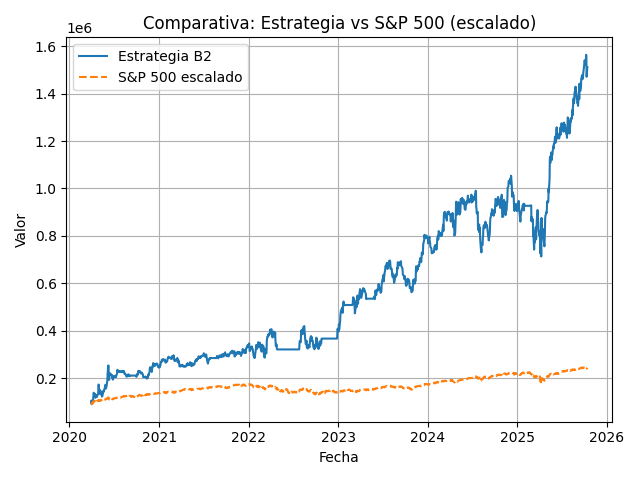
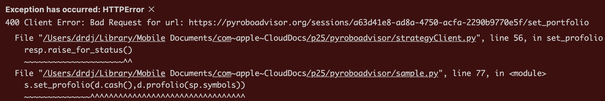

# PyRoboAdvisor

Para conocer el proyecto y la filosofía detrás de PyRoboAdvisor, visita el siguiente enlace: [PyRoboAdvisor](https://pyroboadvisor.com)

# Pre-requisitos
Para ejecutar PyRoboAdvisor, debes comprar una licencia de la estrategia.
Tras la compra llega una clave por correo electrónico.

Si quieres operar PyRoboAdvisor, de forma automatizada puedes usar nuestro código abierto que lo hace a través de la API de Interactive Brokers. Es bajo tu entera responsabilidad la ejecución y automatización de las órdenes de compra y venta. 

# Instalación


Dependiendo del sistema operativo que tengas, la instalación cambia levemente.

- 🪟 **Para Windows 10:** [Sigue este tutorial](tutorial_windows10.md)
- 🍎 **Para macOS:** [Sigue este tutorial](tutorial_macos.md)
- ☁️ **Para Google Colab (simulación en la nube):** [Sigue este tutorial](tutorial_colab.md)


# Ejecución

Tanto para ejecutar como para simular PyRoboAdvisor, utiliza el siguiente comando:
```bash
python3 sample_b.py
````
o en las versiones modernas:
```bash
py sample_b.py
```

Al arrancar te preguntará por tu « **Email** » y por tu « **Key** (clave - Licencia, te llegó al correo al comprarla ) ». Para obtener una key visite https://pyroboadvisor.com

Secuencia
```bash
Debe ingresar su email y key para operar con PyRoboAdvisor.
Para obtener una key, visite https://pyroboadvisor.com
Email: ***********************
Key: ********************************
```

A continuación pregunta por el modo de operación:

```bash
Modo: 
 1. Solo simulación
 2. Purgar caché

 Operar con broker:
  1. Manual
  2. Leer IB + Manual
  3. Leer IB + Escribir IB
  4. Igual que el último día que operé
Seleccione una opción (1/2/3/4/5): 0
```

Vamos a empezar con el modo de simulación, para familiarizarnos con el sistema y sus parámetros.
Y luego explicaremos la instalación del driver de Interactive Brokers. Y su operatoria. Opciones 1 a 4.

Es importante, sobre todo si se cambian los parámetros realizar simulaciones para ajustar el nivel de riesgo y el rendimiento al que estás dispuestos a asumir.

# Simulaciones

La tabla de parámetros se encuentra en el archivo `sample.py` y puedes ajustarla según tus necesidades.

```python
p={
    "fecha_inicio": "2019-01-01",
    "fecha_fin": "2025-12-31",
    "money": 100000,
    "numberStocksInPortfolio": 10,
    "orderMarginBuy": 0.005,  # margen de ordenes de compra y venta
    "orderMarginSell": 0.005,  # margen de ordenes de compra y venta
    "apalancamiento": 10 / 6,  # apalancamiento de las compras
    "ring_size": 240,
    "rlog_size": 24,
    "cabeza": 5,
    "seeds": 100,
    "percentil": 95,
    "prediccion": 1,

    "key": "",
    "email": "",
}
```

El sistema simulador tiene un fin de auditoría y de aprendizaje. La parte privada es una caja negra que es alimentada con la información tal como se produce temporalmente en el mercado. 
Puedes ver el código fuente para verificar cuanto aquí se comenta.

Una de los mayores errores al diseñar una estrategia de trading es usar información futura. Es decir, usar información que no estaba disponible en el momento de la operación.

Puedes observar que nuestra caja negra se alimenta primero de las velas Open, el sistema responde con las operaciones de compra y venta del día y a continuación se simula con el resto de la información de la vela: el High, Low y Close. Close solo tiene fines tasativos.

La idea es muy sencilla, si la orden limite está entre el high y el low de la vela, se ejecuta la orden. Si no, no se ejecuta.

Por eso es importante no alimentar a nuestra caja negra con toda la vela al mismo tiempo. Podría usar información futura y eso sería un error de diseño.

Si sabes programar puedes cambiar el nombre a los simbolos, las fechas, multiplicar una cotización por una constante, etc. Y verás que el sistema es robusto y no se ve afectado por estos cambios.

Describimos a continuación el resto de la simulación.

Los datos lo descargamos de yahoo finance y tardan mucho. Es gratis, una fuente de datos gratis y no puedes exigir mucho por ello.
El que me aporte una nueva fuente de datos le regalo una licencia para la próxima versión.

Nota: Hay algunos acciones que pueden fallar en la descarga, no te preocupes, el sistema las ignora y continúa con las acciones restantes.
Los símbolos los descarga de wikipedia y son la composición del SP500.

Por consola se muestra el progreso de la simulación y al finalizar se genera un 
gráfico con el resultado de la simulación.

```console
2024-04-30 Value: $317250 $43055 ENPH/124 INCY/264 PODD/606 MRNA/720 PCG/1278 RMD/18 TSLA/206 
TAE: 30.97% DDPP: 77.92%/77.77% Comisión: $0.00
2024-05-01 Value: $316576 $43055 ENPH/124 INCY/264 PODD/606 MRNA/720 PCG/1278 RMD/18 TSLA/206 
TAE: 30.88% DDPP: 75.42%/77.76% Comisión: $0.00
2024-05-02 Value: $329023 $43055 ENPH/124 INCY/264 PODD/606 MRNA/720 PCG/1278 RMD/18 TSLA/206 
TAE: 32.04% DDPP: 87.50%/77.77% Comisión: $0.00
2024-05-03 Value: $330670 $43055 ENPH/124 INCY/264 PODD/606 MRNA/720 PCG/1278 RMD/18 TSLA/206 
TAE: 32.17% DDPP: 87.92%/77.79% Comisión: $0.18
2024-05-06 Value: $331146 $25202 ENPH/124 INCY/264 PODD/606 MRNA/720 PAYC/105 PCG/1278 RMD/18 TSLA/206 
TAE: 32.14% DDPP: 88.75%/77.80% Comisión: $0.00
2024-05-07 Value: $334058 $25202 ENPH/124 INCY/264 PODD/606 MRNA/720 PAYC/105 PCG/1278 RMD/18 TSLA/206 
TAE: 32.39% DDPP: 90.42%/77.81% Comisión: $0.00
2024-05-08 Value: $327842 $25202 ENPH/124 INCY/264 PODD/606 MRNA/720 PAYC/105 PCG/1278 RMD/18 TSLA/206 
TAE: 31.79% DDPP: 85.83%/77.82% Comisión: $150.57
2024-05-09 Value: $329793 $100297 AMD/91 ENPH/124 INCY/264 PODD/606 PAYC/105 PCG/1278 RMD/18 TSLA/206 
TAE: 31.95% DDPP: 86.67%/77.83% Comisión: $0.00
2024-05-10 Value: $321358 $100297 AMD/91 ENPH/124 INCY/264 PODD/606 PAYC/105 PCG/1278 RMD/18 TSLA/206 
````
Rentabilidades pasadas no garantizan rentabilidades futuras.

Durante la simulación se muestra:
- La fecha, en formato `YYYY-MM-DD`.
- El valor total de la cartera.
- El valor en efectivo disponible.
- Las acciones en la cartera, con su cantidad.
- El TAE (Tasa Anual Equivalente) de la cartera desde el comienzo de la simulación.
- El draw down por percentiles, tanto el instantaneo como el medio.
- Si ha operado se muestra la comisión pagada en la operación.

El DDPP (Draw Down por Percentiles) es una medida del riesgo de la cartera, que me he inventado. Un número mayor es mejor. Por ejemplo un 100% indica que el valor de tasación está por encima del 100% de los últimos 240 días (1 año).


Gráfica mostrada al final, comparando la estrategia con el índice de referencia.

# Parámetros

Si deseas afinar el algoritmo, puedes modificar los parámetros en el diccionario `p` del archivo `sample_b.py`.

- Los parámetros `fecha_inicio` y `fecha_fin` definen el periodo de simulación.

- Para especificar la cantidad de dolares iniciales, utiliza el parámetro `money`.

- Para modelar el tamañano de acciones en la cartera, utiliza el parámetro `numberStocksInPortfolio`.

- Cada vez que el sistema decide comprar o vender acciones se utiliza el precio de apertura mas un margen. Para ello, utiliza los parámetros `orderMarginBuy` y `orderMarginSell`. Que están en tantos por 1. Por ejemplo, si quieres un margen del 0.5% para las órdenes de compra y venta, debes establecer `orderMarginBuy` y `orderMarginSell` a 0.005.
El objetivo es introducir las ordenes en el book order y pagar menos comisiones.

Si estos valores suben, el sistema compra y vende menos vece, pero el rendimiento no se ve muy mermado. A partir del 5% he observado que compra tan poco que deja de operar. Pagar menos comisiones por hacer menos operaciones a cambio de esperar mas días para ver una rotación. 

Jugar con una asimetría conduce a resultados curiosos.

- Si deseas utilizar el apalancamiento que ofrece el broker, puedes establecer el parámetro `apalancamiento`. Un valor mayor de 1 indica que se está utilizando apalancamiento. Y menor de 1 indica lo contrario. 

El resto de parámetros son internos del algoritmo y no es necesario modificarlos, a menos que sepas lo que estás haciendo:

- `ring_size` es una ventana para suavizar los precios de las acciones y evitar el ruido de las fluctuaciones diarias. Un valor de 240 es adecuado para un periodo de 1 año con datos diarios. Observarás que si lo cambias suele bajar el desempeño. Ya que la bolsa suele tener un ciclos de 240 días laborales por año.

- Ahora se utiliza otro conjunto de días para establecer la tendencia de los precios, que es `rlog_size`. Este parámetro define el número de días que se utilizan para calcular la tendencia de los precios. Un valor de 24 es aproximadamente 1 mes de datos. Un periodo mas pequeño puede detectar tendencias a corto plazo, mientras que un periodo mas grande puede detectar tendencias a largo plazo.

- Se realizan del orden de 'seeds' estimadores. Poner mas seeds puede mejorar la precisión de las predicciones, pero también aumenta el tiempo de ejecución. Un valor de 100 es un buen punto de partida.

- Los estimadores usan un número de acciones como referencia ('cabeza') para establecer el estimador.  

- El parámetro mas poderoso es el `percentil`, en teoría se tendría que usar el percentil 50, pero he observado que el percentil 95 da mejores resultados. Es decir, hay que ser optimista con respecto a las predicciones. 

- El sistema por defecto realiza una predicción de 1 día, es decir, el sistema predice el precio de la acción al día siguiente. Si deseas cambiar esto, puedes modificar el parámetro `prediccion`. Por ejemplo, si quieres predecir el precio a 5 días vista, establece `prediccion` a 5, 10, el número ha de ser menor que la ventana `rlog_size`. Ya que la predicción consume parte de esta ventana. No pongas mas de un 50% del valor de `rlog_size`.

Lo primero que hace el sistema es decargarse los datos de Yahoo Finance. 

```bash
¿Deseas ver una gráfica de la simulación? (s/n): s
```

En algunos entornos como codespaces la visualización de gráficas está restringida. O no te interesa verla.

La siguiente pregunta es sobre el apalancamiento. Recuerda que los primeros días el apalancamiento en la operatoria real recomiendo que sea inferior. En la simulación podemos ir con todo el potencial del apalancamiento. 1 si es cuenta sin margen, o 1.7 si es con margen:

```bash
Apalancamiento: (un número entre 0.0 y 1.8) que representa el uso del cash.
Nota: El cash incluye el 50% de la expectativa de ventas y los dolares disponibles.
Nota: Primerizos, empieza con 0.2 y ve subiendo poco a poco en sucesivos días a medida que compre.
 0   No compres hoy
 0.2 Usa el 20% del cash
 1   Usar todo el dinero disponible
 1.7 Un ligero apalancamiento dispara la rentabilidad, usalo cuando hayas simulado y tengas confianza en la estrategia
Ingrese el apalancamiento: 1.7
``

Se descargan las acciones históricas:
```bash
📥 Descargando BALL desde 2019-01-01 hasta 2025-07-09 con intervalo 1d
📥 Descargando BAX desde 2019-01-01 hasta 2025-07-09 con intervalo 1d
📥 Descargando BBY desde 2019-01-01 hasta 2025-07-09 con intervalo 1d
📥 Descargando BDX desde 2019-01-01 hasta 2025-07-09 con intervalo 1d
📥 Descargando BEN desde 2019-01-01 hasta 2025-07-09 con intervalo 1d
📥 Descargando BF.B desde 2019-01-01 hasta 2025-07-09 con intervalo 1d

1 Failed download:
['BF.B']: YFPricesMissingError('possibly delisted; no price data found  (1d 2019-01-01 -> 2025-07-09)')
⚠️ No se han obtenido datos para BF.B en el rango especificado.
📥 Descargando BG desde 2019-01-01 hasta 2025-07-09 con intervalo 1d
📥 Descargando BIIB desde 2019-01-01 hasta 2025-07-09 con intervalo 1d
📥 Descargando BK desde 2019-01-01 hasta 2025-07-09 con intervalo 1d
```

De vez en cuando falla una, no importa, se ignora. Ten presente que la lista del SP500 la bajamos de la wikipedia y los datos de Yahoo Finance, es normal que algunos símbolos no coincidan. 

He incluido algunos avisos si la descarga es muy temprana (horario americano) ya que se tarda unas horas en tener la vela del día anterior.

Tras la descarga del histórico hay una pequeña pausa. Necesita cargar un año y un mes para empezar a dar consejos. Y durante ese tiempo no hay salidas por consola.

Comienza la simulación.

```console
2024-12-17 Value: $436449 $40946 APA/2342 DXCM/410 ENPH/87 INCY/599 PAYC/385 PCG/1280 PODD/347 SMCI/1827 
TAE: 34.98% DDPP: 93.75%/81.62% Sharpe Log (B/SP500): 1.72
Comisión: $0.00
2024-12-18 Value: $418494 $40946 APA/2342 DXCM/410 ENPH/87 INCY/599 PAYC/385 PCG/1280 PODD/347 SMCI/1827 
TAE: 33.81% DDPP: 92.08%/81.63% Sharpe Log (B/SP500): 1.67
Comisión: $0.00
2024-12-19 Value: $414902 $40946 APA/2342 DXCM/410 ENPH/87 INCY/599 PAYC/385 PCG/1280 PODD/347 SMCI/1827 
TAE: 33.55% DDPP: 91.25%/81.64% Sharpe Log (B/SP500): 1.66
Comisión: $284.83
2024-12-20 Value: $420606 $209399 APA/2342 DXCM/410 ENPH/87 INCY/599 PCG/1280 SMCI/1827 
TAE: 33.90% DDPP: 92.50%/81.65% Sharpe Log (B/SP500): 1.68
Comisión: $3.78
2024-12-23 Value: $425438 $122165 APA/2342 DXCM/410 ENPH/87 INCY/599 MRNA/2237 PCG/1280 SMCI/1827 
TAE: 34.15% DDPP: 92.50%/81.66% Sharpe Log (B/SP500): 1.69
Comisión: $0.90
2024-12-24 Value: $431435 $54414 AMD/534 APA/2342 DXCM/410 ENPH/87 INCY/599 MRNA/2237 PCG/1280 SMCI/1827 
TAE: 34.51% DDPP: 92.92%/81.67% Sharpe Log (B/SP500): 1.70
Comisión: $0.00
2024-12-26 Value: $429879 $54414 AMD/534 APA/2342 DXCM/410 ENPH/87 INCY/599 MRNA/2237 PCG/1280 SMCI/1827 
TAE: 34.36% DDPP: 92.50%/81.68% Sharpe Log (B/SP500): 1.70
Comisión: $0.00
````

Durante la simulación se muestra:
- La fecha, en formato `YYYY-MM-DD`.
- El valor total de la cartera.
- El valor en efectivo disponible.
- Las acciones en la cartera, con su cantidad.

En la segunda línea:
- El TAE (Tasa Anual Equivalente) de la cartera desde el comienzo de la simulación.
- El draw down por percentiles, tanto el instantaneo como el medio.
- El Sharpe Log (A/SP500)

En la tercera línea:
- Si ha operado se muestra la comisión pagada en la operación.

El DDPP (Draw Down por Percentiles) es una medida del riesgo de la cartera, que me he inventado. Un número mayor es mejor. Por ejemplo un 100% indica que el valor de tasación está por encima del 100% de los últimos 240 días (1 año).

ATENCIÓN: la lógica es la inversa que el Draw Down.

El DDPP es el porcentaje de tasaciones de la cartera del último año cuyo valor ha estado por debajo del valor actual.
Hay dos valores, el valor actual y el valor medio.

La mayoría de los días no hay operaciones, es normal. He desarrollado una versión de baja rotacion de cartera para pagar menos comisiones.

El Sharpe Log (B/SP500) es cuantas veces lo hace mejor la estrategia con respecto al SP500. En el caso de 1.70 significa que lo hace un 70% en términos de rentabilidad/varianza. O sea, que aunque tenga mucha varianza, la rentabilidad lo compensa. Durante un tiempo definí que era una estrategia de alto riesgo y ahora con estos datos me tengo que comer mis palabras.

Para mas información véase:
logSP500.md


Termina cuando llega al presente.

En dicho caso si se ha configurado se muestra una gráfica con el resultado.



Cada licencia tiene su propio azar. Controlado por una semilla aleatoria. Esto significa que cada licencia se fija en diferentes dimensiones. Y por lo tanto puede variar el resultado final.

Cambiar la licencia o seleccionarla no tiene impacto en el futuro. Lo importante es la familia que genera la simulación. No el historial de una simulación particular. No hay memoria, por lo tanto son independientes. Es decir, la semilla que te toque no se pude cambiar y pedirme un cambio no tiene lugar. 

La simulación es una demostración de caja negra. Debes coger confianza y familiarizarte con las caidas. Aconsejo poner una cantidad de dinero similar a la que se dispone para operar en real. Es un entrenamiento psicológico. 

# Operando con el driver de Interactive Brokers

Una vez que te hayas familiarizado con la simulación los pasos recomendados son:

1. Operar unos días con IB en modo pruebas. Para familiarizarse con el cambio, la ejecución, problemas iniciales...
2. Fondear la cuenta y operar en real.

Para instalar el driver mira: 
[Driver de Interactive Broker y operatoria en Real](driver/README.md)

A continuación se explica su operatoria, con la nueva versión:

```bash
Modo: 
 0. Solo simulación
 5. Purgar caché

 Operar con broker:
  1. Manual
  2. Leer IB + Manual
  3. Leer IB + Escribir IB
  4. Igual que el último día que operé
Seleccione una opción (1/2/3/4/5): 3
```

El sistema puede operar manualmente o con un driver de Interactive Brokers.
Leer de IB significa que lee las acciones que tienes en tu cartera y las utiliza para operar.
Escribir IB significa que carga las órdenes de compra y venta en tu cartera de Interactive Brokers.

5 es para purgar caché es una opción para limpiar la caché de las acciones y volver a descargarlas desde Yahoo Finance. Esto es útil para vaciar el disco y para repetir la descarga de acciones si hemos tenido algún problema con la conexión a Internet.

La opción 4 repite la última operación que se realizó el día anterior. Es útil si quieres repetir la operación del día anterior sin tener que configurar todo de nuevo.

La operativa manual se describe más adelante, en su propio apartado.

El siguiente parametro que te pregunta es el apalancamiento. En este sistema un apalancamiento de 1, significa que no se utiliza apalancamiento, es decir, que solo se utiliza el dinero disponible en efectivo para comprar acciones. Un apalancamiento de 2 significa que se utiliza el doble de dinero disponible para comprar acciones, es decir, se utiliza el dinero disponible más el dinero prestado del broker.

El broker te permite utilizar un apalancamiento de hasta 2, pero debes configurar la cuenta de tipo margen para poder utilizarlo. En el broker Interactive Brokers, te concede un prestamo y toma como garantía las acciones que tienes en tu cartera. Obviamente esto conlleva un riesgo, pero nada que ver con el apalancamiento de las criptomonedas o los sistemas forex, que pueden llegar a ser de 20.

```bash
Apalancamiento: (un número entre 0.0 y 1.8) que representa el uso del cash.
Nota: El cash incluye el 50% de la expectativa de ventas y los dolares disponibles.
Nota: Primerizos, empieza con 0.2 y ve subiendo poco a poco en sucesivos días a medida que compre.
 0   No compres hoy
 0.2 Usa el 20% del cash
 1   Usar todo el dinero disponible
 1.7 Un ligero apalancamiento dispara la rentabilidad, usalo cuando hayas simulado y tengas confianza en la estrategia
Ingrese el apalancamiento: 1.7
```
Importante: Si eres primerizo, empieza con un apalancamiento de 0.2 y ve subiendo poco a poco en sucesivos días a medida que el sistema compre. Es comun que no compre. No opera todo los días, ya que el sistema no encuentra oportunidades de compra. Esto es importante para diversificar la cartera y los días de entrada. Si no lo haces así, puede emplear todo el capital en una única acción, lo que aumenta la volatilidad de la cartera.

La última pregunta del asistente es:
```bash
A que hora US deseas entrar a operar? (Ej: 10:00 a 12:00) (HH:MM): 10:24
```

Nótese que el mercado Americano abre a las 9:30 y cierra a las 16:00. Recomendamos no operar en la primera media hora, ya que es cuando se producen las mayores fluctuaciones de precios. Por lo tanto, es recomendable entrar entre las 10:00 y las 12:00. Una hora al azar. Ya que el problema es que la adquisicón de los datos de las cotizaciones en tiempo real toma un tiempo y no queremos que haya mucha fluctuacion en el tiempo de adquisición de los datos de todas las acciones del SP500.

Por otro lado debemos operar temprano ya que las ordenes introducidas tanto de compra como de venta son órdenes limites. Esto es, que necesitan que el precio de la acción alcance el precio de la orden para ser ejecutadas. Si se introduce las ordenes muy tarde el mercado no tendrá tiempo para fluctuar y alcanzar el precio de la orden. Por lo tanto, es recomendable operar temprano.

Es importante esperar un tiempo después de la apertura del mercado. Sobre todo si operas con una fuente de datos gratuita como es YFinance (por defecto). 

# En general para todas las operatorias

Hay dos momentos, cuando se descarga el histórico y cuando se dan las órdens.

Importante: La descarga de los datos históricos no se pude hacer muy temprano. He puesto avisos. Por ejemplo a las 6 AM (hora de España) el mercado Americano cambia de dia. Unas horas después  los datos de las velas son cargados. Si cargas muy temprano los datos históricos te quedarás SIN el día de ayer. **Y ESO ES UN GRAN ERROR**. No está filtrado porque a veces hay fines de semana y días festivos.

En caso de que veas este error es que has ejecutado la operatoria ya hoy. 
Puedes comprar una segunda licencia.
O esperarte a mañana.



No pasa nada si un día te saltas la rotación. La mayoría de los días no dará recomendaciones. 

Si todo va bien el resultado fina es de la forma:


Si es operatoria manual, pues toca insertar en el broker la operatoria propuesta o someterla al filtro que estimes oportuno.

# Operativa manual

Esto es cuando se opta por la opción 1. 100% manual, incluso la lectura.

Operar en manual es interesante para operar con brokers en los que la comunidad no tenga un driver.

```bash
Debes incluir el dinero disponible, fecha de hoy, y las posiciones de cartera en la llamada (sample.py)

pra=PyRoboAdvisor(p,1000,"2025-07-09",{
        "AAPL": 20,
        "MSFT": 20,
        "GOOGL": 20,
})
```

Este es el mensaje que se genera la primera vez que operamos en manual o cuando no está ajustada la fecha.

Esto nos indica que debemos abrir el archivo `sample_B.py` e insertar con el formato expuesto, el dinero disponible, la fecha de hoy y las posiciones de cartera.

¿Por que se exige la fecha de hoy? Para aseguarnos de que se ha revisado la cartera y se han actualizado las acciones que tenemos en cartera.

Recuerda que si te equivocas, no podrás operar dos veces con la misma licencia.

Idea: Puedes intentar usar chatGPT para que te complete el código, le pasas una foto del broker. Mis pruebas han sido satisfactorias, incluso con la versión gratuita de chatGPT. Pero obviamente no he probado todos los brokers.

Una vez introducida la posición y vuelto a ejecutar.

A continuación la operatoria es similar a la de Interactive Brokers en modo 2, cuando lee de IB y es manual.
