# Driver de Interactive Broker y operatoria en Real

En este apartado se profudizan en las recomendaciones, la instalación del sistema así como la operatoria.

## Recomendaciones
Recomiendo no empezar con la estrategia en real sin tener en cuenta las siguientes consideraciones:
1. Prueba unos días con una cuenta de Interactive Broker de prueba.

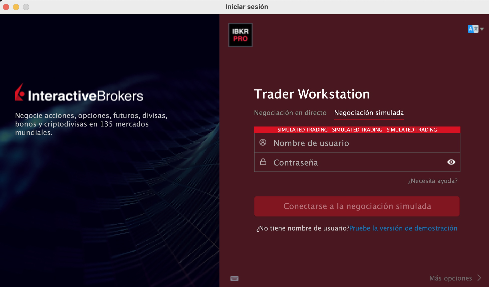

2. En la configuracion de parámetros empieza con apalancamiento progresivo. 0.2, 0.3 el segundo día, etc. Si vas del tirón con un apalancamiento fuerte puedes concentrar toda tu cartera en pocas acciones, en un día con contización alta, etc. Es una forma de diversificar el riesgo de entrada.


## Instlación del driver en python

En el proyecto de python hay que instalar el require del driver.

```bash
cd driver
pip install -r requirements.txt
```

## Instalación, Configuración y preparación de TWS
Una vez que te hayas dado de alta en Interactive Broker:

https://www.interactivebrokers.ie/es/home.php

Puedes descargarte Trader Workstation (TWS):

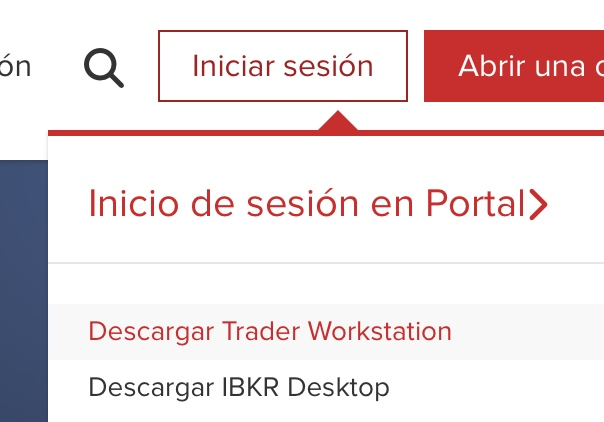

Una vez que hayas hecho la transferencia de fondos.
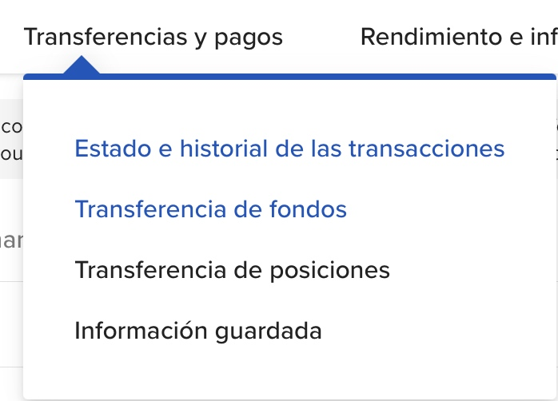

Tarda los días de una transferencia mas uno o dos días. Hazte la idea de 5 días.

Entre tanto puedes practicar con la cuenta demo.


En demo y en real, lo primero que debes hacer es transferir de tu divisa a USD. Por ejemplo, si tienes Euros debes Vender EUR.USD, deja un pequeño margen para pagar la comisión de cambio, pon el importe en CANT. Pon una orden límite, como es una venta el valor está ligeramente por encima del valor de cotización actual (ASK).

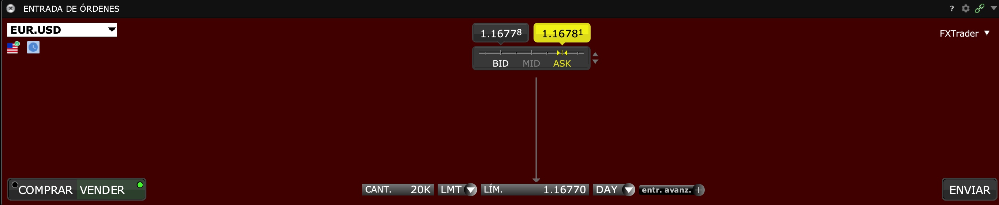

Eso evitará pagar comisiones cuando compres y vendas. A cambio tu inversión estará sugeta a la fluctuación del dolar.

Nada impide operar con otras divisas, pero debes adaptar partes del código. Yo os he dejado con el sample.py una versión funcional con el SP500 y trabajando con USD.

Si no haces lo que te digo a continuación te saltará los siguientes errores:

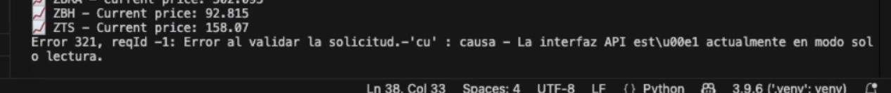


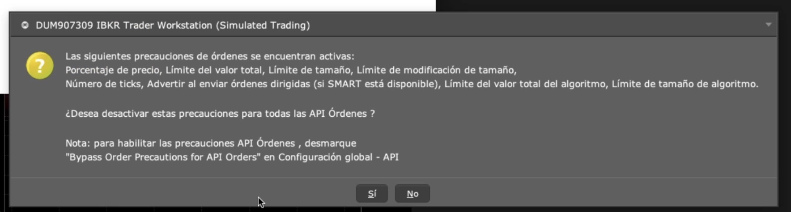


Para operar con python, debemos decirle a TWS que admita un socket y que el API pueda escribir ordenes. Para ellos localiza en el menú:
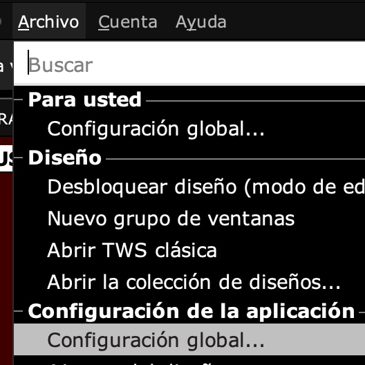

En el menú lateral
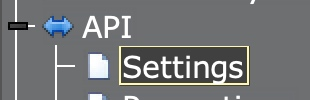

Activa Enable ActiveX y quita la marca de Read-Only: Tal como se ve en la foto.
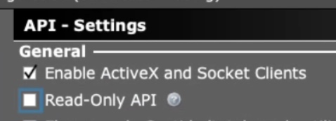

Recuerda que con la licencia solo puedes operar una vez al día con una cuenta real. Si te equivocas en estos pasos tendrás que esperarte un día.

## Operatoria 

Si vas a operar en tiempo real es el momento de abrir TWS.


Lanza el script sample.py en python.


Se descarga el histórico.

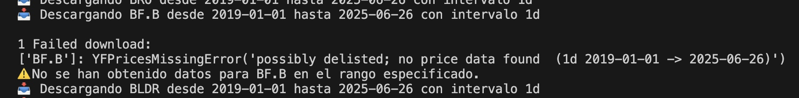

Si falla alguna símbolo de vez en cuando no te preocupes, lo ignora y puede operar.

El sistema cachea la ejecución de hoy, normalmente hay que esperar un tiempo.

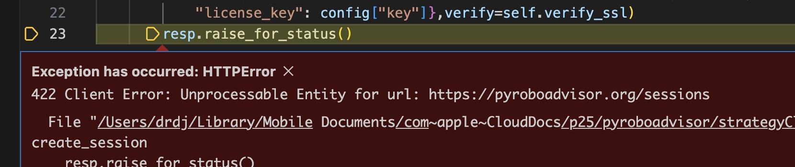
Si te salta este error es que no has comprado la clave e instalado.

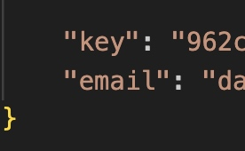

Despues de la descarga se queda un tiempo, mandando el histórico al servidor, pero sin salida por pantalla.

Empieza a simular, uno año y un mes, despúes de la fecha de inicio aproximadamente.

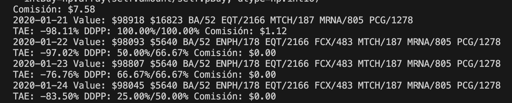

Los campos son:

```console
TAE: 32.39% DDPP: 90.42%/77.81% Comisión: $0.00
2024-05-08 Value: $327842 $25202 ENPH/124 INCY/264 PODD/606 MRNA/720 PAYC/105 PCG/1278 RMD/18 TSLA/206 
TAE: 31.79% DDPP: 85.83%/77.82% Comisión: $150.57
2024-05-09 Value: $329793 $100297 AMD/91 ENPH/124 INCY/264 PODD/606 PAYC/105 PCG/1278 RMD/18 TSLA/206 
TAE: 31.95% DDPP: 86.67%/77.83% Comisión: $0.00
2024-05-10 Value: $321358 $100297 AMD/91 ENPH/124 INCY/264 PODD/606 PAYC/105 PCG/1278 RMD/18 TSLA/206 
````

Durante la simulación se muestra:
- La fecha, en formato `YYYY-MM-DD`.
- El valor total de la cartera.
- El valor en efectivo disponible.
- Las acciones en la cartera, con su cantidad.
- El TAE (Tasa Anual Equivalente) de la cartera desde el comienzo de la simulación.
- El draw down por percentiles, tanto el instantaneo como el medio.
- Si ha operado se muestra la comisión pagada en la operación.

El DDPP (Draw Down por Percentiles) es una medida del riesgo de la cartera, que me he inventado. Un número mayor es mejor. Por ejemplo un 100% indica que el valor de tasación está por encima del 100% de los últimos 240 días (1 año).

ATENCIÓN: la lógica es la inversa que el Draw Down.

El DDPP es el porcentaje de tasaciones de la cartera del último año cuyo valor ha estado por debajo del valor actual.
Hay dos valores, el valor actual y el valor medio.

La mayoría de los días no hay operaciones, es normal. He desarrollado una versión de baja rotacion de cartera para pagar menos comisiones.

Termina cuando llega al presente.

En dicho caso muestra una gráfica con el resultado.
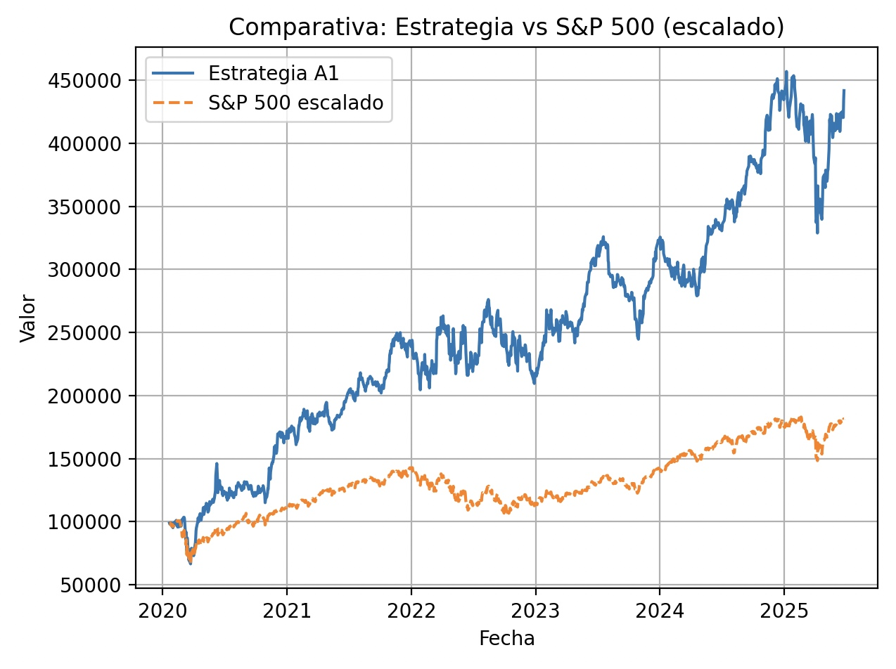

```console
2025-06-25 Value: $441653 $93284 AMD/476 DXCM/633 ENPH/168 EL/922 MRNA/1789 PCG/1278 SMCI/1779 
TAE: 31.44% DDPP: 92.08%/79.27%
```
Si te fija, la cartera será algo diferente a tu cartera. 

Si no has configurado TWS simplemente generará un error y hemos terminado.

# Operatoria en Tiempo Real

Es importante esperar un tiempo después de la apertura del mercado. Sobre todo si operas con una fuente de datos gratuita como es YFinance (por defecto). 

ATENCIÓN: al cerrar la gráfica se procede a operar en tiempo real. Es importante cerrar la gráfica sobre las 4PM - 6PM.

Si quieres automatizarlo comenta la gráfica y pon un timer para la hora.

A mi me gusta mostrar la gráfica como medida de seguridad. De que no te has equivocado con la configuración de la estrategia.

Ahora toca leer tu cartera
Y leer las acciones en tiempo real.

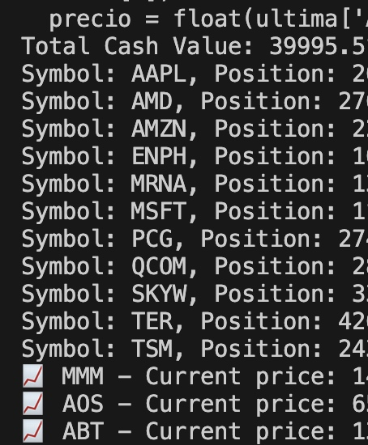

Una vez terminado empezará a insertar las órdenes en TWS.

Si no quieres que introduzca automáticamente las órdenes comenta las líneas del driver ( #d. )

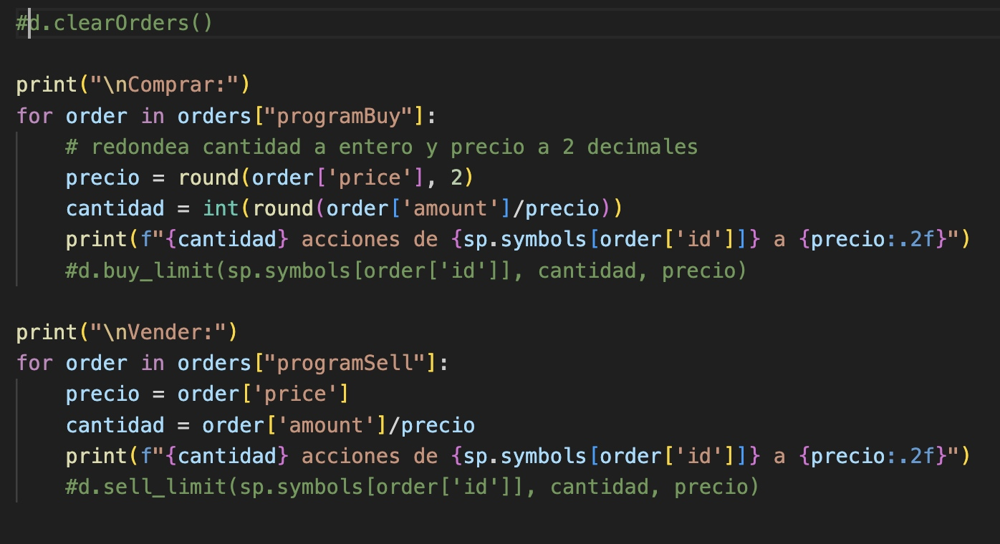

Puedes ver las ordenes señales e introducirlas tu mismo.

En caso de que veas este error es que has ejecutado la operatoria ya hoy. 
Puedes comprar una segunda licencia.
O esperarte a mañana.


No pasa nada si un día te saltas la rotación. La mayoría de los días no dará recomendaciones. 
