# **Tutorial configuración IB**

### Paso 0º Crear cuenta de Interactive Broke

Para crear una cuenta se hace desde aquí: 

Link del portal: https://www.interactivebrokers.ie/es/home.php (Sale arriba a la derecha «ABRIR CUENTA»)

O si lo prefieres, directamente crear cuenta: https://www.interactivebrokers.co.uk/Universal/Application?locale=es_ES

Lo **importante** es que dejes estos parámetros iguales cuando te aparezcan.

1º CUENTA INDIVIDUAL    
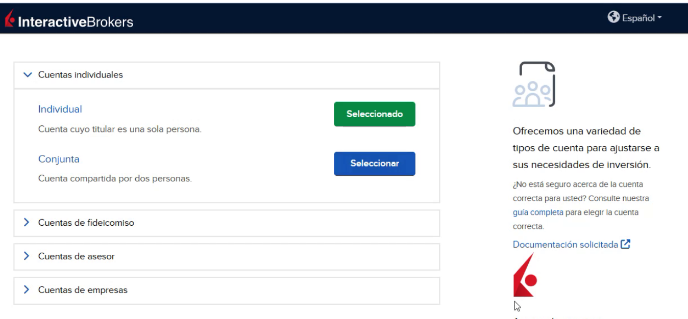

2º TIPO DE CUENTA - Efectivo/«Cash» VS Margen/«Margin»     
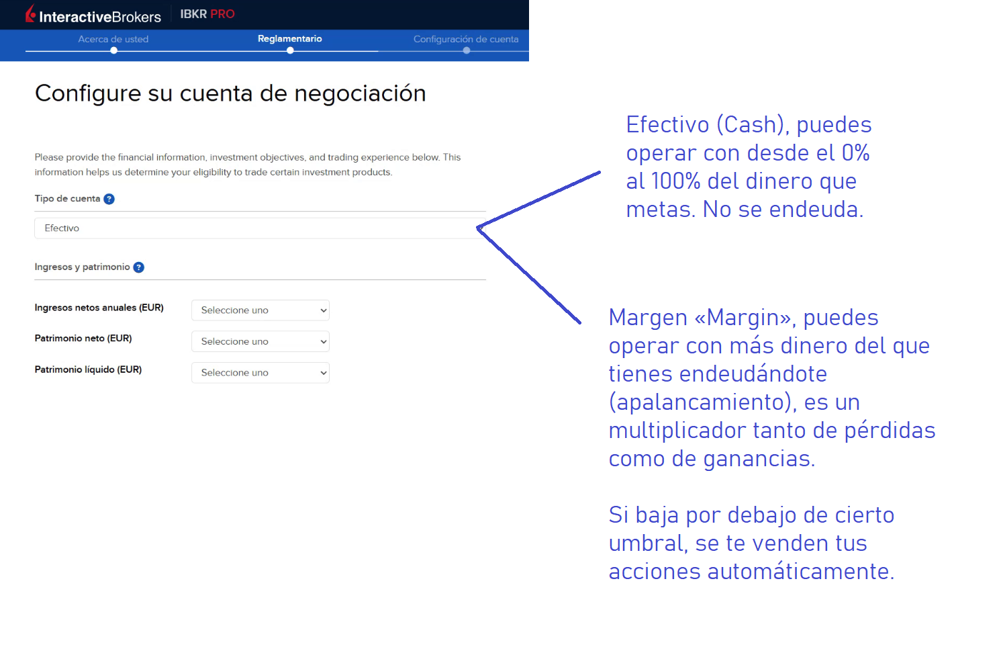

3º TIPO DE INVERSIÓN

Finalmente una vez creada. Si eres de la UE, puedes transferir el dinero para operar con **SEPA**.

### Paso 1º: Configuración portal:
https://www.interactivebrokers.ie/sso/Login?RL=1&locale=es_ES   
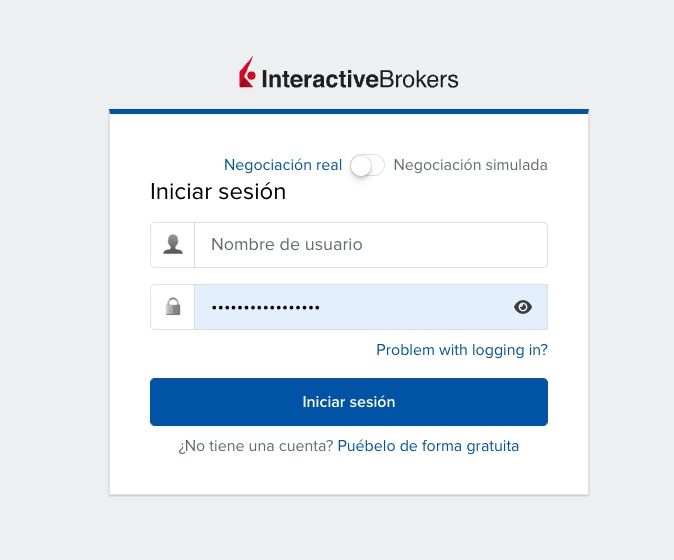

Una vez dentro nos vamos arriba a la derecha, al pequeño monigote blanco.   
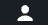

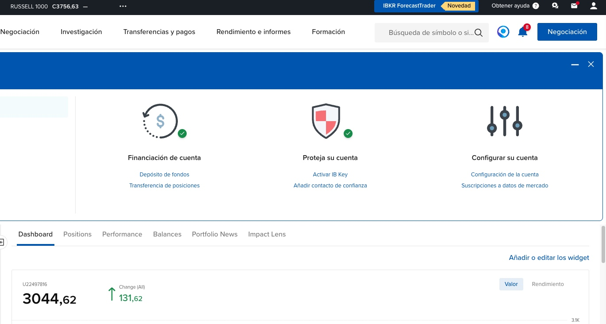

Una vez le demos, le damos a configuración:   
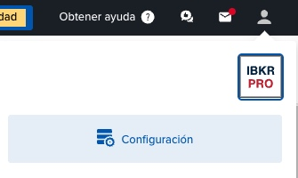

Bajamos un poco, y le damos a:
**Plan de comisiones**, debéis dejarlo por niveles si no vais a meter cantidad muy grandes.   
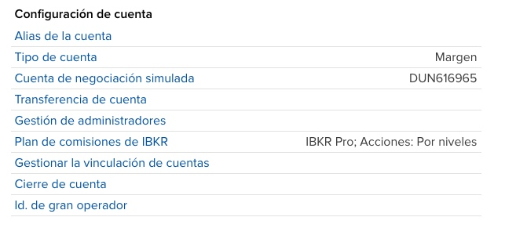

Poned como **Divisa base** - USD   
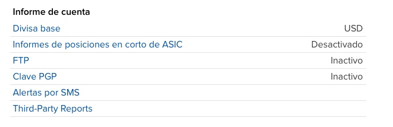

Con esto ya habríamos terminado con la configuración del portal.

### Paso 2º: Configuración Trade Work Station (TWS):

Descargar el programa:

El TWS sin conexión, última versión.   
https://www.interactivebrokers.ie/es/index.php?f=16874   
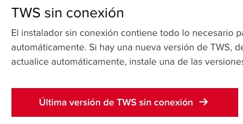

Una vez descargado e instalado. (Instalado cuestión de darle todo a siguiente).

Deberás hacer login:   
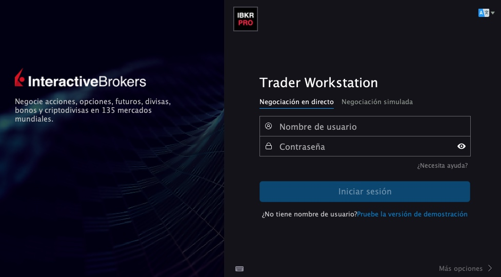

Una vez dentro le vas a dar a (arriba a la izquierda):   
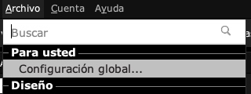

Ahí vas a dejarlo igual que aquí:   

En API - Settings:   
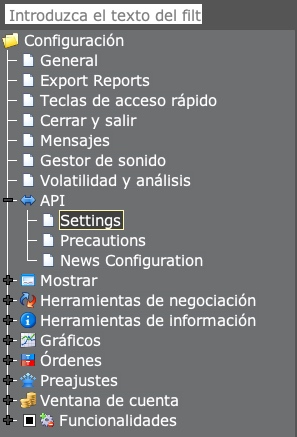

Vas a dejar así las 2 primeras:   
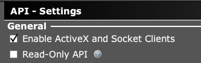

Ahora en cerrar y salir:   
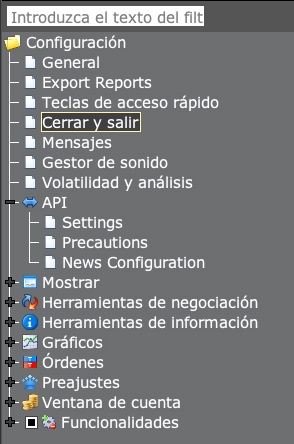

Vas a dejarlo así:   
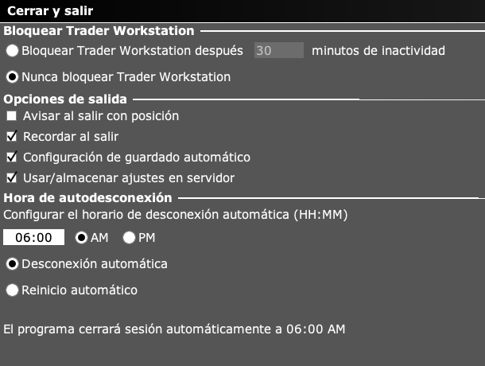

Ya estaría configurado.

De forma extra, podéis cambiar en filtrar:    
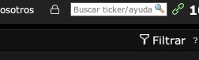

Y dejarlo así:   
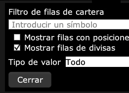

Aquí dejarlo siempre puesto en cartera:   
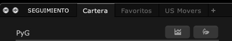

Luego abajo a la izquierda, dejarlo así, para que aparezca **ACTIVAS**, se le debe dar click en ese apartado y darle a **ÓRDENES EN TIEMPO REAL**   
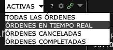

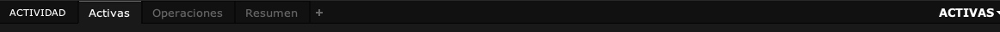

Así, una vez configurado así, en ACTIVAS:   
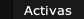
Te saldrán las órdenes de hoy cargadas que no se han ejecutado (no tienen por qué ejecutarse todas, forman parte del normal uso).

Y en OPERACIONES:   
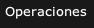
Saldrían aquellas que ya se han ejecutado hoy.

Una vez hecho eso, ya estaría todo perfecto.

Sería cuestión de abrir el Visual Studio Code.

Abrir terminal.

Para el diario:   
`cd "$env:USERPROFILE\pyroboadvisor"; .\venv\Scripts\Activate.ps1; python sample_b.py` 

Para el semanal:   
`cd "$env:USERPROFILE\pyroboadvisor"; .\venv\Scripts\Activate.ps1; python daemon.py` 

Una forma cómoda de disposición en pantalla es dejar TWS achatado encima de VS Code y ir viendo como carga.
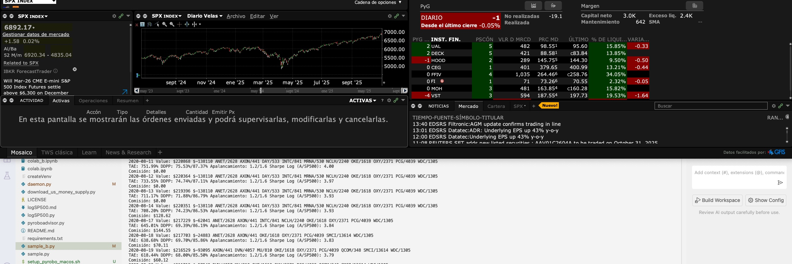

Al terminar verás como van entrando las órdenes en la sección de **ACTIVAS** en directo.

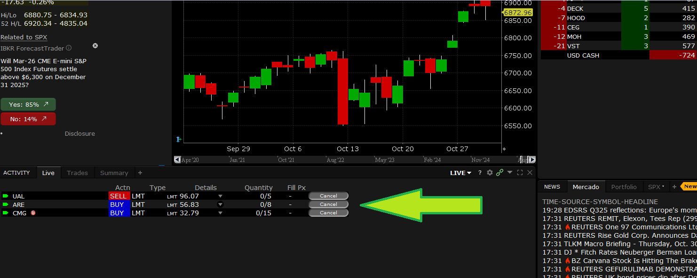

