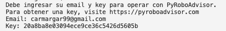

# **Instalación PyRoboAdvisor en macOS**

# Paso 1º: Instalación

Buscas en internet « **visual studio code mac** »\
<https://code.visualstudio.com/download>\

Cuando se te descargue debes **arrastrar** el zip que se ha descargado,
desde **descargas** -\> a -\> **aplicaciones**.

Aquí:\

Una vez ahí le das doble click

Le das a sí.\

Se te abrirá visual studio code.

Si no te aparece con el mismo color que yo tengo no te preocupes.

Le vas a dar aquí debajo, en la tuerca:   
Tuerca - Themes - Color Theme

Y te pones **Quiet Light** o el que prefieras.\

Ahora vamos a poner el instalador de paquetes de mac, debes abrir un
terminal (ctrol + J) /Ó/ (arriba) Terminal - Nuevo Terminal.\

Ahora pones en el terminal el siguiente comando:\
`cd "$HOME" && [ -d "$HOME/pyroboadvisor" ] || git clone https://github.com/daradija/pyroboadvisor.git && /bin/bash -lc 'cd "$HOME/pyroboadvisor" && chmod +x setup_pyrobo_macos.sh && ./setup_pyrobo_macos.sh'`

# Paso 2º: Ejecutar simulación

Debes escribir:

`source "$HOME/venvs/pyroboadvisor/bin/activate" && cd "$HOME/pyroboadvisor" && python ./sample_b.py
`

Te pedirá Email y clave (key, te llegó a tu correo).  

Luego te pedirá el modo, como vamos a hacer una simulación ponemos «
**0** ».

Finalmente te pedirá el apalancamiento, puedes poner « **1.6** » por
ejemplo.

Seguidamente, empezará a ejecutarse, no te preocupes si tarda.

Cuando empiece a calcular por días, saldrán TAEs enormes, no te
preocupes, piensa que está extrapolando los resultados de los primeros
días a todo un año (TAE). Luego se estabiliza.

Finalmente, tal y como hemos indicado, saldrán 2 gráficos.

En el primero veríamos el valor vs el del SP500, y en el segundo una
regresión lineal de la nube de puntos que contrapone las rentabilidades
del SP500 vs tu simulación.   

