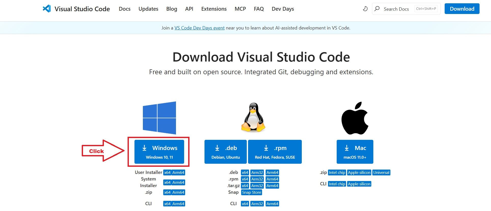
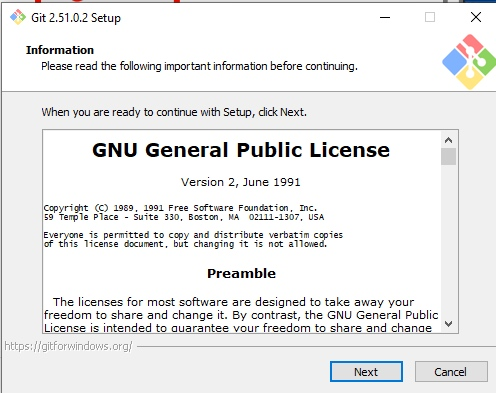
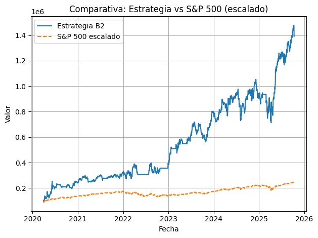

# **Instalación PyRoboAdvisor en Windows10**

# Paso 1º: Instalar «Python»

Pones en el buscador « microsoft store »\

Y le das a este:\

En el buscador pones « python 3.11 »

Y te pones este:\

Le das click a **Obtener**\

Ahora en nuestro buscador de internet, buscamos « visual studio code »\
<https://code.visualstudio.com/download>

Se nos empezará a descargar\

Abre el instalador, dale a todo a siguiente.

# Paso 2º: Instalar «GIT»

Escribe en el buscador « download git »\
<https://git-scm.com/downloads>\

Le damos a **Windows**\

Le das aquí: **Git for Windows/x64 Setup**\

Abre el instalador que acabas de descargar, y dale todo a siguiente
(Next), no hay que cambiar nada.\

Se te instalará correctamente\

Dale a **Finish**\

# Paso 3º: Instalar Visual Studio Code

Busca en google « visual studio code »\

Te llevará aquí, le das a <https://code.visualstudio.com/>

Cuando se termine de descargar, das click al instalador, le das todo a
siguiente.\

# Paso 4º: Terminar instalación

Abre el Visual Studio Code

Le vas a dar a Extensiones y vas a añadir « Python » de Microsoft\

Ahora vas a pulsar ctrol + J, para abrir un terminal (También puedes
arriba dándole a Terminal » New Terminal).

Ahora vamos a descargar el código fuente de PyRoboAdvisor desde el
repositorio oficial de GitHub:

Escribe en el terminal:

`git clone <https://github.com/daradija/pyroboadvisor.git>`

`cd pyroboadvisor`

Ahora vas a poner este comando para crear un entorno virtual para que no
tenga conflictos con otras dependencias de python:  
`python3 -m venv venv`

Luego pondrás en el terminal

`venv\Scripts\activate`  

Vamos a abrir el proyecto\

Abrimos sample_b.py\

Ahora le vas a dar aquí:\

En el buscador que te va a aparecer, le vas a dar a « Python: Select
Interpreter »\

De entre las opciones que te saldrán, deberás darle a la que aparece con
(venv)\

Volvemos al terminal, vas a darle a ctrol + J para invocarlo.\

Vas a poner este comando:\
`python -m pip install --upgrade pip`

Luego vas a poner este:\
`pip install -r requirements.txt`

Queda poco. Ahora vas a poner:\
`cd driver`

Y luego (sí, es el mismo de antes):\
`pip install -r requirements.txt`

Finalmente pon:\
`cd ..`

**¡¡¡Ya lo tendrías instalado!!!**

Vamos a hacer una simulación:

Escribe: python sample_b.py

Te pedirá el *Email* y la *key (la que te llegó por correo)*.\
Escribe el email ENTER Pon tu key ENTER

Ahora te aparecera un pequeño menu, como queremos hacer una simulación
ponemos « **0** » y luego ENTER.

Nos preguntará si queremos ver una gráfica al final, escribe « s » y
dale a ENTER.\

Ahora nos pedirá el apalancamiento. Vamos a poner 1.6 por ejemplo y vas
a pulsar ENTER.

Y esto empezará a funcionar, tarda bastante, no te preocupes.\

Al principio de la simulación mostrará TAEs enormes, no te preocupes es
normal. Eso se debe a que está extrapolando los resultados de los
primeros días a todo un año, por lo que las variaciones son enormes,
luego se estabiliza.\

Finalmente te mostrará dos gráficos.\

En el primero vemos el valor de nuestra operativa con nuestra estrategia cotrapuesto al del SP500.

En el segundo una nube de puntos con una regresión lineal de los valores contrapuestos del SP500 y los de nuestra operativa.
