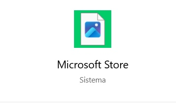
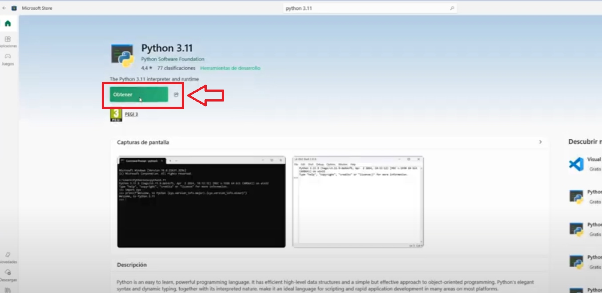
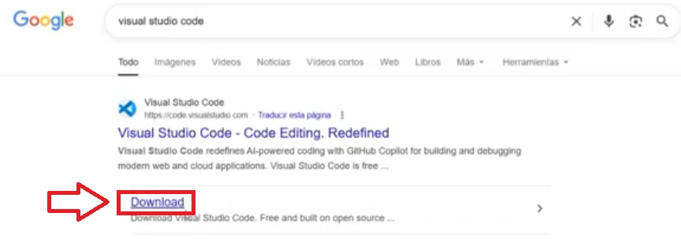
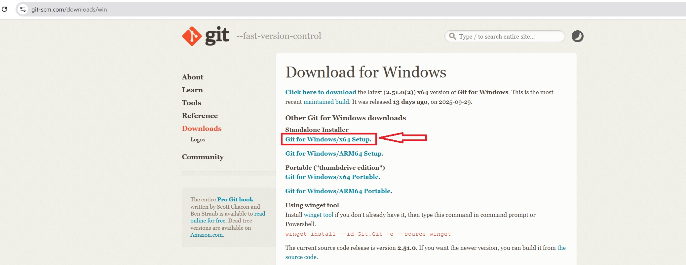
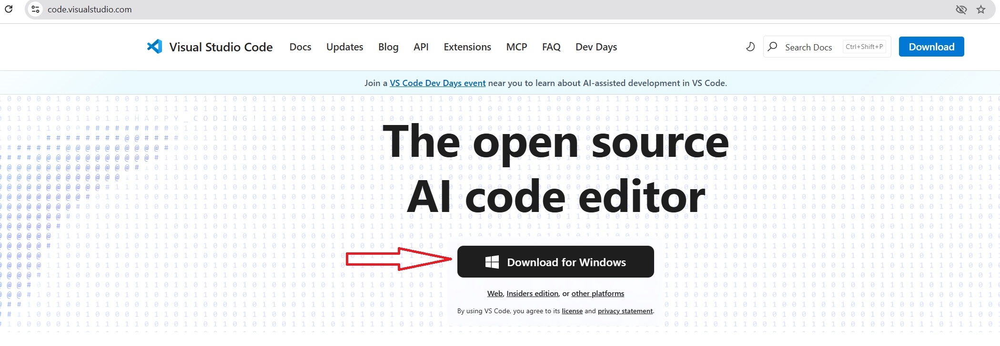
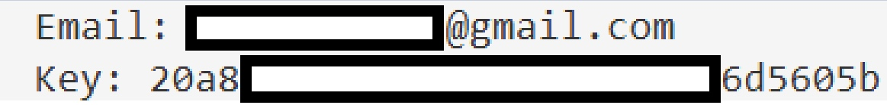
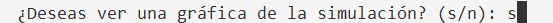
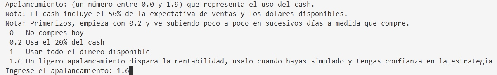
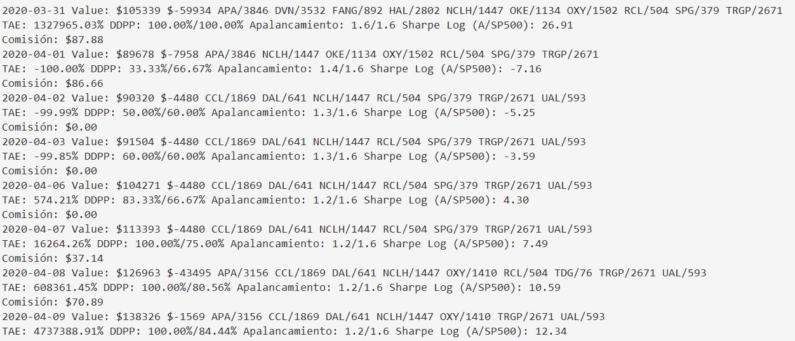

# **Instalación PyRoboAdvisor en Windows 10 y 11**

# Paso 1º: Instalar «Python»

Pones en el buscador « microsoft store »\

Y le das a este:\

En el buscador pones « python 3.11 », si no te aparece pones el 12, no pasa nada.

Y te pones este:\

Le das click a **Obtener**\

Ahora en nuestro buscador de internet, buscamos « visual studio code »\
<https://code.visualstudio.com/download>

Se nos empezará a descargar\

Abre el instalador, dale a todo a siguiente.

# Paso 2º: Instalar «GIT»

Escribe en el buscador « download git »\
<https://git-scm.com/downloads>\

Le damos a **Windows**\

Le das aquí: **Git for Windows/x64 Setup**\

Abre el instalador que acabas de descargar, y dale todo a siguiente
(Next), no hay que cambiar nada.\

Se te instalará correctamente\

Dale a **Finish**\

# Paso 3º: Instalar Visual Studio Code

Busca en google « visual studio code »\

Te llevará aquí, le das a <https://code.visualstudio.com/>

Cuando se termine de descargar, das click al instalador, le das todo a
siguiente.\

# Paso 4º: Terminar instalación

Abre el Visual Studio Code, pulsa **control + J** para abrir terminal.

Ahora as a ejecutar el instalador, copia pega en el terminal:

`powershell Set-ExecutionPolicy -Scope CurrentUser -ExecutionPolicy RemoteSigned -Force; cd "$env:USERPROFILE"; $env:PATH += ";C:\Program Files\Git\cmd;C:\Program Files\Git\bin";git clone "https://github.com/daradija/pyroboadvisor.git"; Set-ExecutionPolicy Bypass -Scope Process -Force; cd "$env:USERPROFILE\pyroboadvisor"; .\setup_pyrobo.ps1 -OpenVSCode -RestartVSCode
`

**¡¡¡Ya lo tendrías instalado!!!**

Abre el terminal de nuevo con **control + J** y copia pega:   
`cd "$env:USERPROFILE\pyroboadvisor"; .\venv\Scripts\Activate.ps1; python .\sample_b.py`

Guárdate este comando para cuando quieras volver a usar pyroboadvisor (simulación y operatoria diaria).

Vamos a hacer una simulación:

Escribe: python sample_b.py

Te pedirá el *Email* y la *key (la que te llegó por correo)*.\
Escribe el email ENTER Pon tu key ENTER

Ahora te aparecera un pequeño menu, como queremos hacer una simulación
ponemos « **0** » y luego ENTER.

Nos preguntará si queremos ver una gráfica al final, escribe « s » y
dale a ENTER.\

Ahora nos pedirá el apalancamiento. Vamos a poner 1.6 por ejemplo y vas
a pulsar ENTER.

Y esto empezará a funcionar, tarda bastante, no te preocupes.\

Al principio de la simulación mostrará TAEs enormes, no te preocupes es
normal. Eso se debe a que está extrapolando los resultados de los
primeros días a todo un año, por lo que las variaciones son enormes,
luego se estabiliza.\

Finalmente te mostrará dos gráficos.\

En el primero vemos el valor de nuestra operativa con nuestra estrategia cotrapuesto al del SP500.

En el segundo una nube de puntos con una regresión lineal de los valores contrapuestos del SP500 y los de nuestra operativa.
